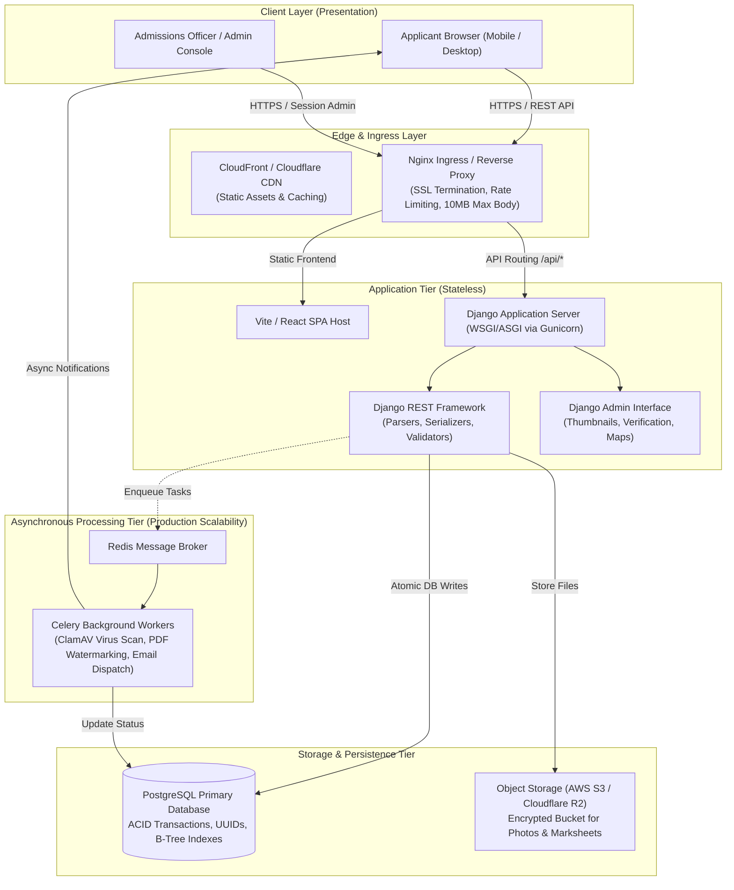
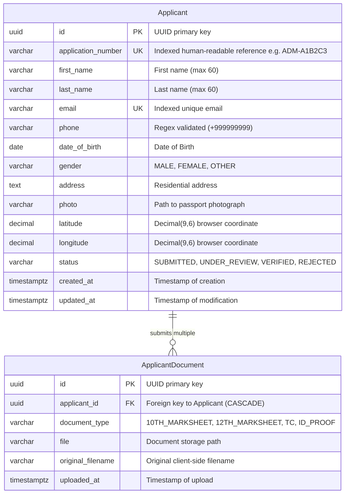

# College Admission Online Registration Portal
### Enterprise Full-Stack System Architecture & Machine Test Implementation

[](https://www.djangoproject.com/)
[](https://www.django-rest-framework.org/)
[](https://react.dev/)
[](https://vitejs.dev/)
[](https://sass-lang.com/)
[](https://www.postgresql.org/)

---

## 1. Executive Summary & Tech Stack

This project is a production-ready, scalable **College Admission Online Registration System** engineered to handle high-concurrency student admissions, multi-part document ingestion, geographic coordinate tagging, and administrative auditing.

- **Backend**: Python 3.14 / Django 5.2, Django REST Framework (DRF), `django-environ`, `django-cors-headers`, Pillow, `psycopg` (PostgreSQL driver).
- **Frontend**: React 19, Vite, Modular Sass (SCSS) design tokens, Axios HTTP client with response interceptors, Lucide icons, HTML5 Geolocation API.
- **Database**: PostgreSQL (with automatic zero-config SQLite fallback for local developer testing).

---

## 2. System Design Architecture

The platform follows a layered, decoupled service-oriented architecture designed to scale independently under burst admission registration periods.

### 2.1 High-Level Architecture Diagram



---

### 2.2 End-to-End Registration Flow (Sequence Diagram)

```mermaid
sequenceDiagram
    autonumber
    actor Student as Applicant (Browser)
    participant UI as React SPA (Vite + Sass)
    participant API as Django DRF (/api/applicants/)
    participant Validator as Strict File Validator
    participant DB as PostgreSQL Database
    participant Storage as File / Media Storage

    Student->>UI: Fills Step 1 (Personal details: Name, Email, Phone, DOB)
    UI->>API: GET /api/applicants/check-email/?email=...
    API-->>UI: 200 OK (Email availability status)
    
    Student->>UI: Fills Step 2 (Uploads Photo, 10th & 12th Marksheets)
    UI->>UI: Client validation (extensions, sizes < 2MB/5MB, live preview)
    
    Student->>UI: Triggers Step 3 (Captures Browser Geolocation)
    UI->>Student: Requests navigator.geolocation.getCurrentPosition()
    Student-->>UI: Grants permission; Lat/Lng captured
    
    Student->>UI: Confirms Declaration & Clicks "Submit Application"
    UI->>API: POST /api/applicants/ (multipart/form-data)
    
    activate API
    API->>Validator: Inspect file extensions (.jpg, .png, .pdf)
    API->>Validator: Inspect MIME magic headers (anti-spoofing)
    API->>Validator: Verify coordinate ranges (-90 to +90, -180 to +180)
    
    alt Validation Failure
        Validator-->>API: ValidationError (e.g., file too large / invalid magic bytes)
        API-->>UI: 400 Bad Request (Formatted field-level errors)
        UI-->>Student: Displays actionable error banners on affected step
    else Validation Success
        API->>DB: Begin Atomic Transaction
        API->>Storage: Persist Photo (applicants/photos/<uuid>/photo.ext)
        API->>DB: INSERT INTO admissions_applicant (...)
        API->>Storage: Persist 10th & 12th marksheets
        API->>DB: INSERT INTO admissions_applicantdocument (FK -> applicant)
        API->>DB: Commit Transaction
        API-->>UI: 201 Created (application_number: "ADM-XXXXXX", full payload)
        deactivate API
        UI-->>Student: Renders Success Screen with Application Reference ID & Print Option
    end
```

---

### 2.3 Database Schema & Entity-Relationship (ER) Diagram



---

## 3. Security Architecture & Threat Modeling

| Security Threat | Attack Vector | Mitigation Implemented |
| :--- | :--- | :--- |
| **Malicious File Upload** | Attacker uploads `.php` or executable script renamed to `.png` or `.pdf` | Multi-layered validation: (1) Extension whitelist, (2) Magic bytes header inspection (e.g. `%PDF`, `\x89PNG`, `\xff\xd8\xff`), (3) Collision-resistant random UUID filenames. |
| **Denial of Service (DoS)** | Giant multi-gigabyte uploads saturating disk & memory | Strict request bounds: `DATA_UPLOAD_MAX_MEMORY_SIZE = 10MB`, `MAX_PHOTO_SIZE = 2MB`, `MAX_DOCUMENT_SIZE = 5MB`. |
| **Object Enumeration (IDOR)** | Attacker enumerates `/api/applicants/1`, `/api/applicants/2` | Primary keys use non-sequential UUIDv4. Application reference numbers use random hex nonces (`ADM-XXXXXX`). |
| **Cross-Site Request Forgery (CSRF)** | Unauthorized actions from malicious sites | Django CSRF protection enabled for session endpoints; REST API isolated with strict `CORS_ALLOWED_ORIGINS` filtering. |
| **SQL Injection** | Input manipulation via form fields | Complete reliance on Django ORM parameterized queries and sanitized serial fields. |
| **Email Collision / Race Conditions** | Concurrent submissions with identical email | Database-level unique constraint on `Applicant.email` coupled with `transaction.atomic()` during creation. |

---

## 4. Scalability & High Availability Roadmap

1. **Decoupled Asynchronous Tasks (Celery + Redis)**:
   - Offload heavy tasks (OCR of marksheet text, ClamAV anti-virus scanning, and automated welcome email with PDF acknowledgment receipts) to background Celery workers so HTTP requests respond within < 150ms.
2. **Media Storage Offloading (AWS S3 / GCS)**:
   - Configure `django-storages` with `boto3` to store uploaded photos and marksheets directly into private S3 buckets, served via signed URLs with CloudFront edge caching.
3. **Database Concurrency & Read-Replicas**:
   - For high-volume admission release dates, route read queries (e.g., student application status lookups, search filters) to read replicas using Django database routing.
   - Utilize PgBouncer for transaction-level connection pooling.
4. **Containerization**:
   - Provide multi-stage Dockerfiles and Helm charts for Kubernetes cluster deployment with Horizontal Pod Autoscaling (HPA) triggered by CPU/Request metrics.

---

## 5. API Documentation

### Base URL: `http://localhost:8000/api`

#### 1. Submit Application
- **Method**: `POST`
- **Path**: `/applicants/`
- **Content-Type**: `multipart/form-data`
- **Parameters**:
  - `first_name` (string, required)
  - `last_name` (string, required)
  - `email` (string, required, unique)
  - `phone` (string, required, e.g., `+919876543210`)
  - `date_of_birth` (string: `YYYY-MM-DD`, required)
  - `gender` (string: `MALE`, `FEMALE`, `OTHER`, required)
  - `address` (string, required)
  - `photo` (file, required, max 2MB, image/jpeg, image/png)
  - `marksheet_10th` (file, required, max 5MB, pdf/jpeg/png)
  - `marksheet_12th` (file, required, max 5MB, pdf/jpeg/png)
  - `transfer_certificate` (file, optional, max 5MB)
  - `latitude` (decimal, optional, e.g. `12.971598`)
  - `longitude` (decimal, optional, e.g. `77.594566`)
- **Response (201 Created)**:
  ```json
  {
    "message": "Application submitted successfully.",
    "application_number": "ADM-7B2F89",
    "data": {
      "id": "7f8b9a2c-1234-4567-89ab-cdef01234567",
      "application_number": "ADM-7B2F89",
      "first_name": "Aarav",
      "last_name": "Sharma",
      "email": "aarav.sharma@example.com",
      "phone": "+919876543210",
      "status": "SUBMITTED",
      "photo_url": "http://localhost:8000/media/applicants/photos/.../photo.png",
      "latitude": "12.971598",
      "longitude": "77.594566",
      "documents": [
        {
          "id": "...",
          "document_type": "10TH_MARKSHEET",
          "file_url": "http://localhost:8000/media/applicants/documents/.../10th.pdf"
        }
      ]
    }
  }
  ```

#### 2. Check Email Availability
- **Method**: `GET`
- **Path**: `/applicants/check-email/?email=candidate@example.com`
- **Response (200 OK)**:
  ```json
  {
    "available": true
  }
  ```

#### 3. List All Submitted Applications (100% Public & Lightweight)
- **Method**: `GET`
- **Path**: `/applicants/all/`
- **Description**: Returns the complete list of all registered applicants (ordered latest first) with text fields and geolocation coordinates only (no media/documents payload).
- **Response (200 OK)**:
  ```json
  [
    {
      "id": "7f8b9a2c-1234-4567-89ab-cdef01234567",
      "application_number": "ADM-7B2F89",
      "first_name": "Aarav",
      "last_name": "Sharma",
      "email": "aarav.sharma@example.com",
      "phone": "+919876543210",
      "date_of_birth": "2005-06-15",
      "gender": "MALE",
      "gender_display": "Male",
      "address": "Flat 402, Sunshine Heights, MG Road, Bengaluru",
      "latitude": "12.971598",
      "longitude": "77.594566",
      "status": "SUBMITTED",
      "status_display": "Submitted",
      "created_at": "2026-09-21T09:15:00Z"
    }
  ]
  ```

#### 4. Filter & Search Applicants (Paginated)
- **Method**: `GET`
- **Path**: `/applicants/?search=Sharma&status=SUBMITTED&page=1`
- **Response (200 OK)**: Paginated results list.

---

## 6. Local Setup & Execution Guide

### Prerequisites
- Python 3.10+ (tested on Python 3.14)
- Node.js v18+ & npm
- PostgreSQL (or automatic fallback to local SQLite)

### 6.1 Backend Setup (Django)

```bash
# 1. Navigate to backend directory
cd backend

# 2. Activate virtual environment
# (On macOS/Linux):
source venv/bin/activate
# (On Windows):
# venv\Scripts\activate

# 3. Install dependencies
pip install -r requirements.txt

# 4. Configure environment variables
# Copy .env.example to .env
cp .env.example .env

# 5. Create the database in PostgreSQL (if not already created):
createdb college_admissions
# (Alternatively, to use SQLite for quick zero-config testing, set DATABASE_URL=sqlite:///db.sqlite3 in .env)

# 6. Execute database migrations
python manage.py makemigrations admissions
python manage.py migrate

# 6. Run automated test suite
python manage.py test admissions

# 7. Create an admin superuser
python manage.py createsuperuser

# 8. Start development server
python manage.py runserver 8000
```
- API Base URL: `http://localhost:8000/api/`
- Django Admin Portal: `http://localhost:8000/admin/`

---

### 6.2 Frontend Setup (React + Vite + Sass)

```bash
# 1. Navigate to frontend directory
cd frontend

# 2. Install dependencies
npm install

# 3. Verify production bundle builds cleanly
npm run build

# 4. Start Vite development server
npm run dev
```
- Frontend Portal: `http://localhost:5173/`

---

## 7. Automated Test Coverage

The test suite in `backend/admissions/tests.py` verifies:
- `test_successful_applicant_registration`: Full submission with image, PDF marksheets, and coordinates.
- `test_duplicate_email_rejected`: Enforces unique email constraints with HTTP 400 response.
- `test_invalid_file_extension_rejected`: Rejects executable `.exe` or disallowed extensions.
- `test_oversized_photo_rejected`: Rejects photos exceeding the 2MB boundary.
- `test_check_email_endpoint`: Verifies real-time asynchronous email availability endpoint.

Run all tests anytime with:
```bash
cd backend
python manage.py test admissions -v 2
```
